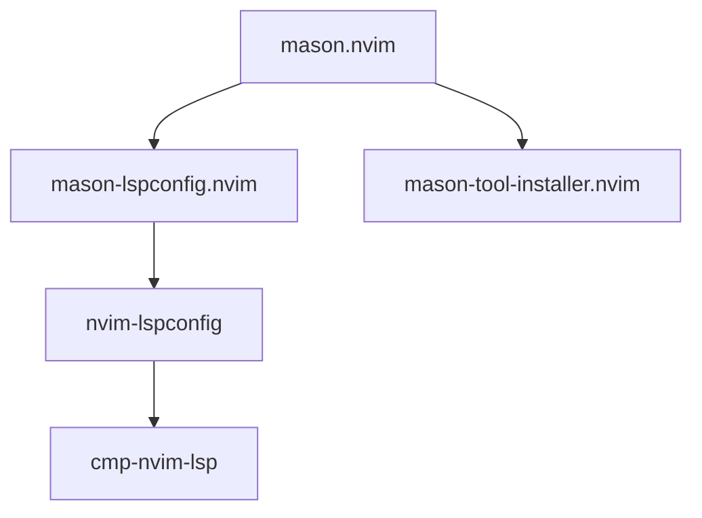

# Mason LSP Installer

Mason is a portable package manager for Neovim that installs and manages LSP servers, formatters, linters, and other tools.

## Configuration

The Mason configuration is defined in `lua/leyland/plugins/lsp/mason.lua` and consists of two main components:

### 1. LSP Server Installation

Managed by `mason-lspconfig.nvim`:

```lua
{
  "williamboman/mason-lspconfig.nvim",
  opts = {
    ensure_installed = {
      "ts_ls",
      "html",
      "cssls",
      "tailwindcss",
      "svelte",
      "lua_ls",
      "graphql",
      "emmet_ls",
      "prismals",
      "pyright",
      "eslint",
    },
  },
}
```

### 2. Tool Installation

Managed by `mason-tool-installer.nvim`:

```lua
{
  "WhoIsSethDaniel/mason-tool-installer.nvim",
  opts = {
    ensure_installed = {
      "prettier",
      "stylua",
      "isort",
      "black",
      "pylint",
      "eslint_d",
    },
  },
}
```

## Installed LSP Servers

<AccordionGroup>
  <Accordion title="ts_ls - TypeScript Language Server" icon="js">
    **Language:** JavaScript, TypeScript, JSX, TSX
    
    **Features:**
    - Type checking
    - IntelliSense
    - Code navigation
    - Refactoring
    - Auto-imports
    
    **File types:** `.js`, `.ts`, `.jsx`, `.tsx`
  </Accordion>

  <Accordion title="html - HTML Language Server" icon="code">
    **Language:** HTML
    
    **Features:**
    - Tag completion
    - Attribute suggestions
    - Syntax validation
    - Emmet integration
    
    **File types:** `.html`, `.htm`
  </Accordion>

  <Accordion title="cssls - CSS Language Server" icon="palette">
    **Language:** CSS, SCSS, LESS
    
    **Features:**
    - Property completion
    - Color preview
    - Syntax validation
    - Vendor prefix suggestions
    
    **File types:** `.css`, `.scss`, `.less`
  </Accordion>

  <Accordion title="tailwindcss - Tailwind CSS IntelliSense" icon="wind">
    **Language:** HTML, JSX, Vue, Svelte with Tailwind
    
    **Features:**
    - Class name completion
    - Color preview
    - Variant suggestions
    - CSS property hints
    
    **Configuration:** Automatically detects `tailwind.config.js`
  </Accordion>

  <Accordion title="svelte - Svelte Language Server" icon="bolt">
    **Language:** Svelte
    
    **Features:**
    - Component intellisense
    - TypeScript support
    - CSS scoping
    - Reactive declarations
    
    **File types:** `.svelte`
  </Accordion>

  <Accordion title="lua_ls - Lua Language Server" icon="moon">
    **Language:** Lua
    
    **Features:**
    - Neovim API completion
    - Type checking
    - Documentation hints
    - Workspace diagnostics
    
    **Special configuration:** Enhanced with `lazydev.nvim` for Neovim API support
    
    **File types:** `.lua`
  </Accordion>

  <Accordion title="graphql - GraphQL Language Server" icon="diagram-project">
    **Language:** GraphQL
    
    **Features:**
    - Schema validation
    - Query completion
    - Field suggestions
    - Fragment navigation
    
    **File types:** `.graphql`, `.gql`
  </Accordion>

  <Accordion title="emmet_ls - Emmet Language Server" icon="code">
    **Language:** HTML, CSS, JSX, Vue
    
    **Features:**
    - Abbreviation expansion
    - CSS property shortcuts
    - Multi-cursor support
    - Custom snippets
    
    **Example:** Type `div.container>ul>li*5` and expand
  </Accordion>

  <Accordion title="prismals - Prisma Language Server" icon="database">
    **Language:** Prisma Schema
    
    **Features:**
    - Schema validation
    - Model completion
    - Relation suggestions
    - Formatting
    
    **File types:** `.prisma`
  </Accordion>

  <Accordion title="pyright - Python Language Server" icon="python">
    **Language:** Python
    
    **Features:**
    - Type checking
    - IntelliSense
    - Import resolution
    - Refactoring
    
    **File types:** `.py`
  </Accordion>

  <Accordion title="eslint - ESLint Language Server" icon="circle-check">
    **Language:** JavaScript, TypeScript
    
    **Features:**
    - Linting diagnostics
    - Auto-fix on save
    - Rule documentation
    - Custom configuration
    
    **Configuration:** Reads `.eslintrc.*` files
  </Accordion>
</AccordionGroup>

## Installed Tools

### Formatters

<CardGroup cols={2}>
  <Card title="prettier" icon="sparkles">
    **Languages:** JS, TS, HTML, CSS, JSON, YAML, Markdown, GraphQL
    
    Opinionated code formatter with minimal configuration.
  </Card>

  <Card title="stylua" icon="moon">
    **Language:** Lua
    
    Fast Lua formatter with sensible defaults.
  </Card>

  <Card title="isort" icon="arrow-down-1-9">
    **Language:** Python
    
    Sorts and organizes Python imports.
  </Card>

  <Card title="black" icon="python">
    **Language:** Python
    
    The uncompromising Python code formatter.
  </Card>
</CardGroup>

### Linters

<CardGroup cols={2}>
  <Card title="pylint" icon="python">
    **Language:** Python
    
    Static code analysis for Python.
  </Card>

  <Card title="eslint_d" icon="bolt">
    **Language:** JavaScript/TypeScript
    
    Fast ESLint daemon for improved performance.
  </Card>
</CardGroup>

## Mason UI

Mason provides a user-friendly interface for managing packages:

### Opening Mason

```vim
:Mason
```

### UI Icons

Custom icons indicate package status:

- `✓` - Package installed
- `➜` - Package pending installation
- `✗` - Package uninstalled

<Note>
The UI configuration is defined in `lua/leyland/plugins/lsp/mason.lua:23-30`.
</Note>

### UI Commands

Within the Mason UI:

- `i` - Install package under cursor
- `u` - Update package under cursor
- `X` - Uninstall package under cursor
- `U` - Update all packages
- `/` - Filter packages
- `g?` - Show help

## How It Works

<Steps>
  <Step title="Plugin Loading">
    Mason plugins are loaded as dependencies of the LSP configuration through Lazy.nvim.
  </Step>

  <Step title="Automatic Installation">
    On first launch, Mason checks the `ensure_installed` lists and installs any missing packages.
  </Step>

  <Step title="LSP Configuration">
    Once installed, LSP servers are automatically configured and attached to appropriate file types.
  </Step>

  <Step title="Updates">
    Run `:Mason` and press `U` to update all installed packages.
  </Step>
</Steps>

## Adding New Servers

To add a new LSP server or tool:

<Steps>
  <Step title="Edit the configuration">
    Open `lua/leyland/plugins/lsp/mason.lua` and add the server name to the appropriate `ensure_installed` table.
  </Step>

  <Step title="Find available servers">
    Browse available packages:
    ```vim
    :Mason
    ```
    Or visit [mason-registry](https://mason-registry.dev/registry/list).
  </Step>

  <Step title="Restart Neovim">
    The new server will be installed automatically on next launch.
  </Step>
</Steps>

<Tip>
For LSP servers, add them to `mason-lspconfig.nvim`'s `ensure_installed` list. For formatters and linters, add them to `mason-tool-installer.nvim`'s list.
</Tip>

## Dependency Chain

The Mason setup has a specific dependency chain:



1. **mason.nvim** - Core package manager
2. **mason-lspconfig.nvim** - Bridges Mason with nvim-lspconfig
3. **mason-tool-installer.nvim** - Installs additional tools
4. **nvim-lspconfig** - LSP server configurations
5. **cmp-nvim-lsp** - Completion capabilities

<Note>
The dependency chain is automatically managed by Lazy.nvim based on the `dependencies` key in plugin specifications (see `lua/leyland/plugins/lsp/mason.lua:20-34`).
</Note>

## Troubleshooting

<AccordionGroup>
  <Accordion title="LSP server not working" icon="circle-exclamation">
    1. Check if the server is installed: `:Mason`
    2. Check LSP status: `:LspInfo`
    3. Restart the LSP: `<leader>rs`
    4. Check for errors: `:messages`
  </Accordion>

  <Accordion title="Installation fails" icon="triangle-exclamation">
    1. Check internet connection
    2. Verify Mason log: `:Mason` → `g?` for help
    3. Try manual installation: `:Mason` → select package → press `i`
    4. Check system dependencies (some servers require Node.js, Python, etc.)
  </Accordion>

  <Accordion title="Server crashes frequently" icon="bolt">
    1. Check for conflicting configurations
    2. Update the server: `:Mason` → select server → press `u`
    3. Check server logs in `~/.local/state/nvim/lsp.log`
    4. Try reinstalling: uninstall then install again
  </Accordion>
</AccordionGroup>

## Additional Dependencies

The Mason configuration includes additional helpful plugins:

### nvim-lsp-file-operations

Provides LSP-aware file operations:

- Automatic import updates when moving files
- Refactoring support for file renames
- Workspace-wide file operation handling

**Source:** `lua/leyland/plugins/lsp/lsp.lua:5`

### lazydev.nvim

Enhances Lua development for Neovim:

- Neovim API completion
- Plugin development support
- Lazy.nvim integration
- Proper type checking for Neovim APIs

**Source:** `lua/leyland/plugins/lsp/lsp.lua:6`

<Warning>
Do not remove `lazydev.nvim` if you plan to configure Neovim or develop plugins. It provides essential Lua LSP enhancements.
</Warning>

## Next Steps

<CardGroup cols={2}>
  <Card title="LSP Overview" icon="book" href="/lsp/overview">
    Learn about the overall LSP architecture
  </Card>
  <Card title="Completion" icon="sparkles" href="/lsp/nvim-cmp">
    Configure autocompletion sources
  </Card>
  <Card title="Formatting" icon="wand-magic-sparkles" href="/lsp/formatting">
    Set up code formatting
  </Card>
</CardGroup>